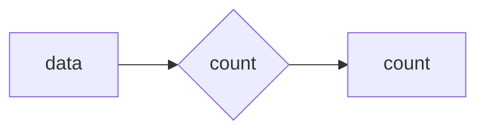

# Dataset versioning with Pachyderm

#### Blog page: https://www.linkedin.com/pulse/data-management-dataset-versioning-alexander-ryabov/

- https://www.pachyderm.com
- https://github.com/pachyderm/pachyderm

### Pachyderm Community Edition
#### For small teams that prefer to build and support their own software.
  - Apache License 2.0
  - Up to 16 Data-Driven Pipelines
  - Parallel Workers Limited to 8
  - Not support Role Based Access Controls (RBAC)
  - Not support Pluggable Authentication
### Pachyderm Enterprise Edition
  - Commercial license
  - Unlimited Data-Driven Pipelines
  - Unlimited Parallel Processing
  - Role Based Access Controls (RBAC)
  - Pluggable Authentication
  - Enterprise Support

### Features
- Data-driven pipelines automatically trigger based on detecting data changes.
- Immutable data lineage with data versioning of any data type.
- Autoscaling and parallel processing built on Kubernetes for resource orchestration.
- Uses standard object stores for data storage with automatic deduplication.
- Web UI for visualizing running pipelines and exploring data
- JupyterLab mount extension

### Integrations
- Determined, deep learning platform for training machine learning models
- Google BigQuery, connector ingests the result of a BigQuery query into Pachyderm
- JupyterLab, Notebooks are connected directly to your Pachyderm projects, repos, branches, and data
- Label Studio, a multi-type data labeling and annotation tool with standardized output format [GitHub](https://github.com/HumanSignal/label-studio/)
- Superb AI, a data labeling platform that supports image, video, text, and audio data
- Weights and Biases, a tool for tracking and visualizing machine learning experiments

### Deployment options:
- Local: https://docs.pachyderm.com/products/mldm/latest/set-up/local-deploy/
- Cloud (AWS, Azure, GCP): https://docs.pachyderm.com/products/mldm/latest/set-up/cloud-deploy/
- On-Prem (Kubernetes & Openshift): https://docs.pachyderm.com/products/mldm/latest/set-up/on-prem/

### Documentation
https://docs.pachyderm.com/

### Setup (Local Deploy)

I followed [Local Deploy](https://docs.pachyderm.com/products/mldm/latest/set-up/local-deploy/) guide to setup Pachyderm on my laptop.
Unfortunately with `kind` what I had already it did not work for me, \
so I used minikube instead.

see the commands in [Makefile](Makefile)

It's Kubernetes based, so it's easy to deploy on any cloud provider or on-premises.
But I suppose in real life  use case it will be a lot of effort to set up Pachyderm on the production environment.
Kubernetes' storage, volumes, network, security, monitoring, etc.

### Usage

`pachctl` is Git-like tool used to interact with pachyderm cluster\
like git it calculates hash of the data and stores it in the object store.
the files with the same hashes are considered same and are not stored again.
branches are called branches repos are called repos, commits are called commits, and files are called files.

```
> pachctl --help

Environment variables:
  PACH_CONFIG=<path>, the path where pachctl will attempt to load your config.
  JAEGER_ENDPOINT=<host>:<port>, the Jaeger server to connect to, if PACH_TRACE
    is set
  PACH_TRACE={true,false}, if true, and JAEGER_ENDPOINT is set, attach a Jaeger
    trace to any outgoing RPCs.
  PACH_TRACE_DURATION=<duration>, the amount of time for which PPS should trace
    a pipeline after 'pachctl create-pipeline' (PACH_TRACE must also be set).

Usage:
  pachctl [command]

Administration Commands:
  auth         Auth commands manage access to data in a Pachyderm cluster
  enterprise   Enterprise commands enable Pachyderm Enterprise features
  idp          Commands to manage identity provider integrations

Commands by Action:
  copy         Copy a Pachyderm resource.
  create       Create a new instance of a Pachyderm resource.
  delete       Delete an existing Pachyderm resource.
  diff         Show the differences between two Pachyderm resources.
  edit         Edit the value of an existing Pachyderm resource.
  finish       Finish a Pachyderm resource.
  get          Get the raw data represented by a Pachyderm resource.
  glob         Print a list of Pachyderm resources matching a glob pattern.
  inspect      Show detailed information about a Pachyderm resource.
  list         Print a list of Pachyderm resources of a specific type.
  put          Insert data into Pachyderm.
  restart      Cancel and restart an ongoing task.
  squash       Squash an existing Pachyderm resource.
  start        Start a Pachyderm resource.
  stop         Cancel an ongoing task.
  subscribe    Wait for notifications of changes to a Pachyderm resource.
  update       Change the properties of an existing Pachyderm resource.
  wait         Wait for the side-effects of a Pachyderm resource to propagate.

Other Commands:
  completion   Print or install terminal completion code.
  config       Manages the pachyderm config.
  debug        Debug commands for analyzing a running cluster.
  exit         Exit the pachctl shell.
  fsck         Run a file system consistency check on pfs.
  license      License commmands manage the Enterprise License service
  logs         Return logs from a job.
  mount        Mount pfs locally. This command blocks.
  port-forward Forward a port on the local machine to pachd. This command blocks.
  resume       Resume a stopped task.
  run          Manually run a Pachyderm resource.
  shell        Run the pachyderm shell.
  unmount      Unmount pfs.
  version      Print Pachyderm version information.

Additional help topics:
  branch       Docs for branches.
  commit       Docs for commits.
  datum        Docs for datums.
  file         Docs for files.
  job          Docs for jobs.
  object       Docs for objects.
  pipeline     Docs for pipelines.
  repo         Docs for repos.
  transaction  Docs for transactions.

Use "pachctl [command] --help" for more information about a command.
```

### Pipelines
Additional useful feature is pipeline, which is a DAG of data processing steps.
each step is a container that takes input data from previous step and produces output data.

here pipeline example from the documentation:

```yaml
pipeline:
    name: 'count'
description: 'Count the number of lines in a csv file'
input:
    pfs:
        repo: 'data'
        branch: 'master'
        glob: '/'
transform:
    image: alpine:3.14.0
    cmd: ['/bin/sh']
    stdin: ['wc -l /pfs/data/iris.csv > /pfs/out/line_count.txt']
```
Will process the data from the `data` dataset and store the result in the `count` dataset.

A nice additional benefit is that the pipeline is triggered automatically when the data in the `data` dataset changes.
We can create triggers for branch or pipeline

For example, create SQL table with the result of the pipeline (from the output CSV file)


Also, because it's git inspired nature we have data lineage and can see the history of the data processing. 

### BigQuery support
I was wondering how Pachyderm supports BigQuery, I expected that it would be able to read data from BigQuery 
and update the dataset on the changes in the BigQuery table.

But this connector just reads the BigQuery dataset and stores it as parquet files. A bit disappointing

there was a plan to support SQL ingests, but it has not been implemented yet.
```
https://github.com/pachyderm/docs-content/blob/main/.archive/sql-ingest.md
```

### Conclusion
On first impression, I like Pachyderm. It's easy to use, leverages Kubernetes and has useful features.
for file-based data processing, it's a good choice.
But I think it still needs to improve and add SQL ingests as mentioned, but implemented in the way \
it will be able to read the data from the BigQuery and update the dataset on the changes in the BigQuery table.\
maybe it's on the roadmap, I don't know.